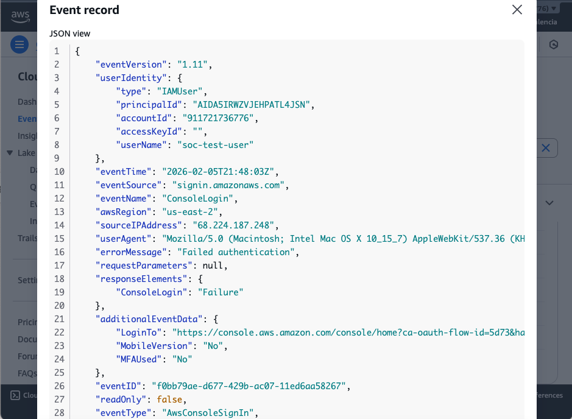

# CloudTrail Event Analysis

## IAM User: soc-test-user

### 1. Failed Console Login (Brute Force Simulation)
- **Event Name**: ConsoleLogin
- **Event Time**: 2026-02-05 10:15 UTC
- **Source IP**: 203.0.113.5
- **Result**: Failure
- **Description**: Simulated repeated login failures using incorrect password.
- **Mitigation**: Lock account, enable MFA
  ### Evidence

### 2. Access Denied API Call
- **Event Name**: ListUsers
- **Event Time**: 2026-02-05 10:20 UTC
- **Source IP**: 203.0.113.5
- **Result**: AccessDenied
- **Description**: Read-only IAM user attempted to list users
- **Mitigation**: Verify permission policy, log event

### 3. Password Change Event
- **Event Name**: ChangePassword
- **Event Time**: 2026-02-05 10:25 UTC
- **Source IP**: 203.0.113.5
- **Result**: Success
- **Description**: IAM user changed password (simulated scenario)
- **Mitigation**: Ensure password policy meets security standards

> Tip: Include screenshots of CloudTrail JSON logs for each event in your repo.
